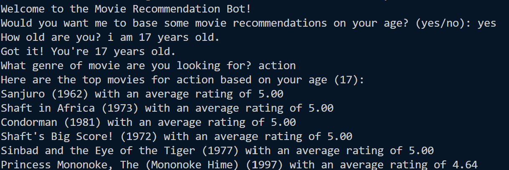

# Movie_Chatbot




Program works even without saying "yes" or "no" due to sentiment analysis with BERT

## 😀Introduction

I always found NLP intresting and what better way to learn more about NLP than building a chatbot using BERT language model?

## 💡What is this project about?

This project is a test of my abilities to scrape movie data from <a href="https://github.com/Moonshallow5/Movie_Chatbot/tree/main/ml-1m">ml-1m.</a> More info is said on <a href="https://github.com/Moonshallow5/Movie_Chatbot/blob/main/ml-1m/README">readme.md.</a>


But basically we have 3 main files: <a href="https://github.com/Moonshallow5/Movie_Chatbot/blob/main/ml-1m/movies.dat"> movies.dat</a>, <a href="https://github.com/Moonshallow5/Movie_Chatbot/blob/main/ml-1m/ratings.dat"> ratings.dat</a> and <a href="https://github.com/Moonshallow5/Movie_Chatbot/blob/main/ml-1m/users.dat"> users.dat</a>

And my objective for this project is to have a bot ask questions on the terminal to a new user:

Questions like:

 **"Would you want me to suggest movies to watch based on your age?"**

**"Do you have a specific genre you like?"**

And following the data from <a href="https://github.com/Moonshallow5/Movie_Chatbot/tree/main/ml-1m">MovieLens</a> I'll take the users answers and sort the movies in descending order on what the bot thinks is best for the user to watch.

If you want to run the program make sure to just ```pip install -r requirements.txt```


## 🚧Problems Faced

I haven't used pandas before so learning the documentation on how to use it was pretty tough. 

Furthermore, I have only used machine learning models for image classification, but this was a whole diffrent ball game as my model need to be able to have proper conversations with a human, and what better model to use than the BERT language model.


## 🔧Errors encountered

The data in <a href="https://github.com/Moonshallow5/Movie_Chatbot/tree/main/ml-1m">ml-1m</a> will never be a valid set, because some movies are only rated once by 1 random person, but other movies might have much more ratings from more people, so this dataset is definetly not valid, but I just wanted to test my data sorting skills and NLP.


## Further implementations


- Use more of BERT language model in the program

- Have a better, and more accurate dataset.

- Have more try and except functions for edge cases which I didn't implement yet

- Have a beter GUI


### CITATION
================================================================================

To acknowledge use of the dataset in publications, please cite the following
paper:

F. Maxwell Harper and Joseph A. Konstan. 2015. The MovieLens Datasets: History
and Context. ACM Transactions on Interactive Intelligent Systems (TiiS) 5, 4,
Article 19 (December 2015), 19 pages. DOI=http://dx.doi.org/10.1145/2827872


### ACKNOWLEDGEMENTS

Thanks to Shyong Lam and Jon Herlocker for cleaning up and generating the data
set.

================================================================================